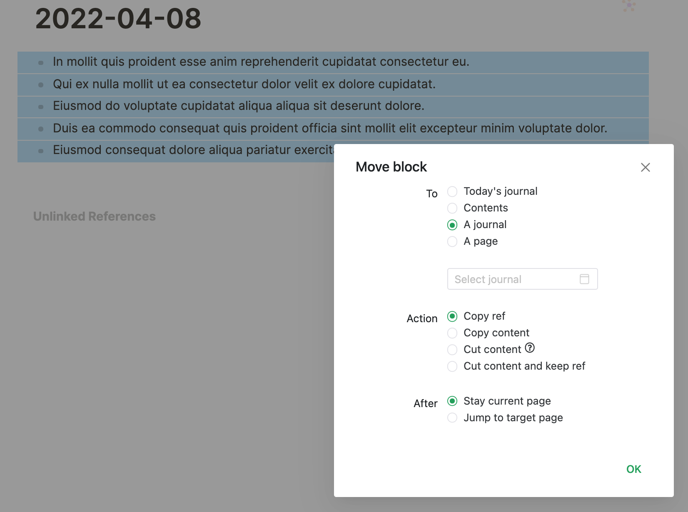

# Logseq Plugin Move Block

A Logseq plugin to help you manage block movement.

## Usage

The default key-binding for the UI is: `mod+shift+m`

## Install

### Manually

1. Git clone this repo
2. Run `npm install`
3. Run `npm run build`
4. In logseq, click `Plugins` which is in right top dropdown menu
5. Click `Load unpacked plugin` button and select the dist directory of this plugin directory
6. If plugin not work, you can try to disable and enable the plugin by clicking the switch button on Plugins page.

### Marketplace

Better choice.

## Inspiration and Thanks

The inspiration of this plugin comes from our community.

> Possible new feature - while on any page, right click a block and send the block ref to today's journal. This can be useful for todo created in pages -- danzu on 2021/10/26

At the same time, I have similar thinking about this, but I want to copy ref to any page, Then I found Logseq command API can not receive parameters for now, So I realize that It's better to implment "copying to today's journal" first.

My code borrowed greatly from two other open source projects as followed, thank you guys.

- [logseq-extract-plugin](https://github.com/sidharth-panwar/logseq-extract-plugin)
- [logseq-plugin-block-to-page](https://github.com/hyrijk/logseq-plugin-block-to-page)

## Buy me a coffee

If my plugin solve your situation a little bit and you will, you can choose to buy me a coffee via [this](https://www.buymeacoffee.com/vipzhicheng) and [this](https://afdian.net/@vipzhicheng).

## Licence

MIT
